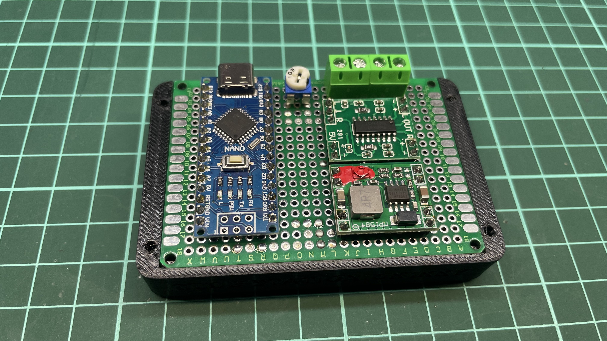
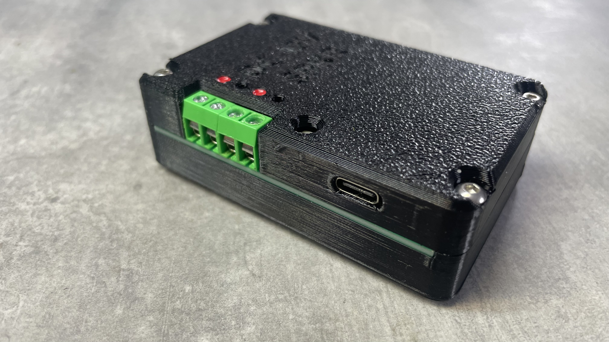
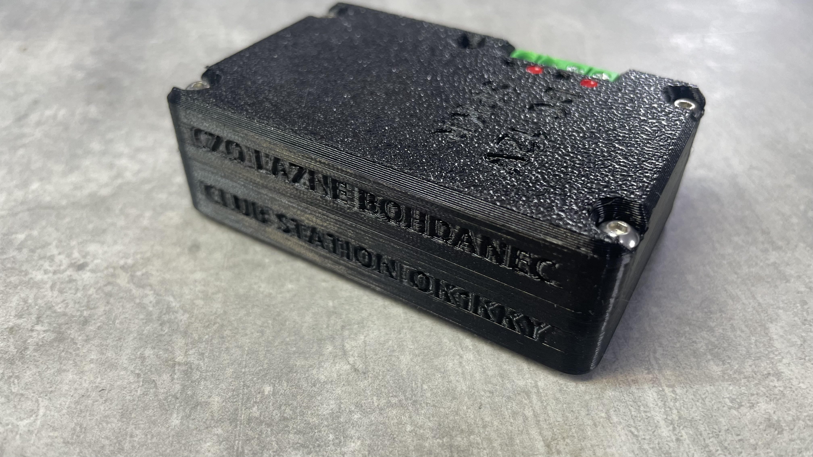

# CW QSO Simulator

Arduino sketch that simulates a realistic radio QSO between two stations in CW. It generates authentic sidetones with variations in jitter and timing.

## Features

- Two-station QSO simulation with independent speed and frequency
- Configurable WPM (words per minute) for each station
- Realistic timing jitter ±% to simulate natural radio operation
- Customizable sidetone frequencies (650–820 Hz typical)
- Serial console logging of each transmission
- Repeating QSO cycles with pauses

## Installation

1. Open `cw-qso-simulator.ino` in Arduino IDE
2. Upload to your Arduino board
3. Connect a piezo speaker to the configured pin (default: pin 9)

## Configuration

Edit these constants in the sketch to customize:

| Setting | Default | Purpose |
|---------|---------|---------|
| `SPEAKER_PIN` | 9 | Digital output pin for tone |
| `WPM_STATION_1` | 18 | Station 1 speed (words per minute) |
| `WPM_STATION_2` | 16 | Station 2 speed (words per minute) |
| `FREQ_STATION_1` | 650 Hz | Station 1 sidetone frequency |
| `FREQ_STATION_2` | 820 Hz | Station 2 sidetone frequency |
| `JITTER_PCT` | 5 | Timing variation ±% |
| `PAUSE_TX_MS` | 1500 | Pause between transmissions (ms) |
| `PAUSE_QSO_MS` | 8000 | Silence after complete QSO (ms) |

Edit `STATION_STATION_1` and `STATION_STATION_2` to change callsigns.

## Customizing the QSO Script

The `QSO_SCRIPT[]` array defines the conversation. Each entry specifies which station transmits and what text to send:

```cpp
static const QSOStep QSO_SCRIPT[] = {
    { &STATION_STATION_1, "HELLO" },
    { &STATION_STATION_2, "HI THERE" },
    { &STATION_STATION_1, "HOW R U" },
    { &STATION_STATION_2, "IM FINE" },
};
```

- First element: `&STATION_STATION_1` or `&STATION_STATION_2`
- Second element: text to send in Morse code (alphanumeric, spaces, and `/` supported)

Add or remove entries to create your own QSO. The script repeats continuously with `PAUSE_QSO_MS` silence between cycles.

## Example installation



